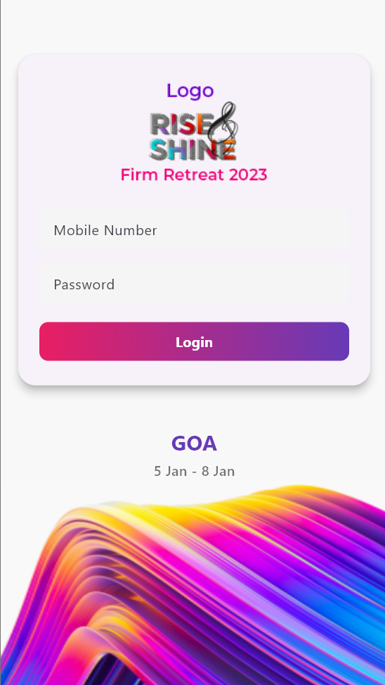
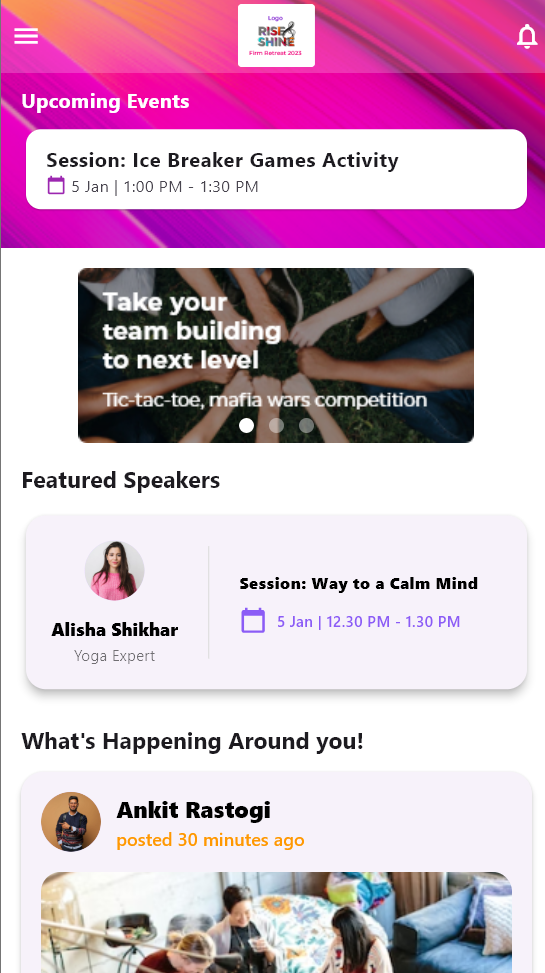
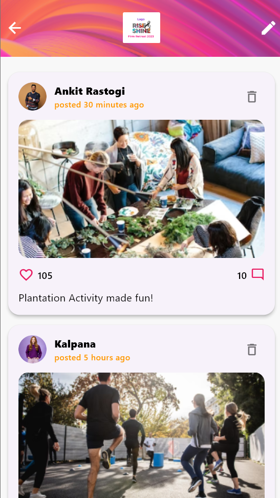
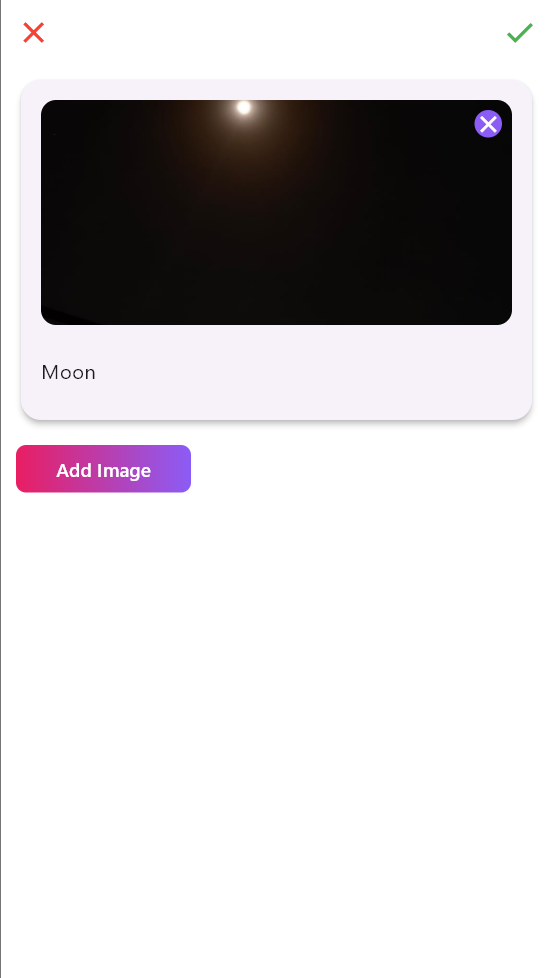
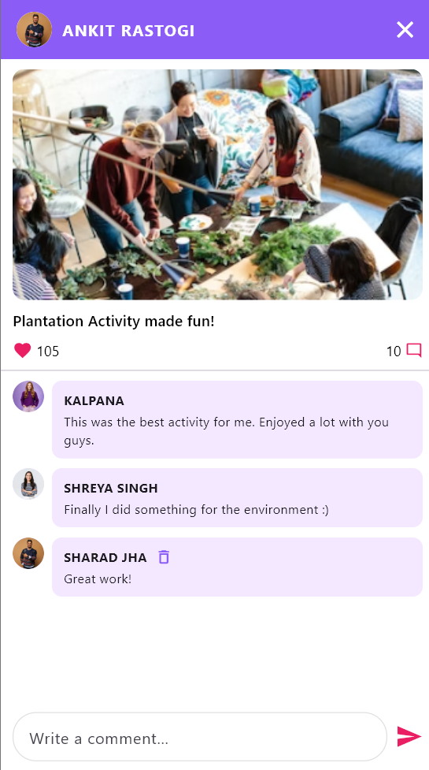
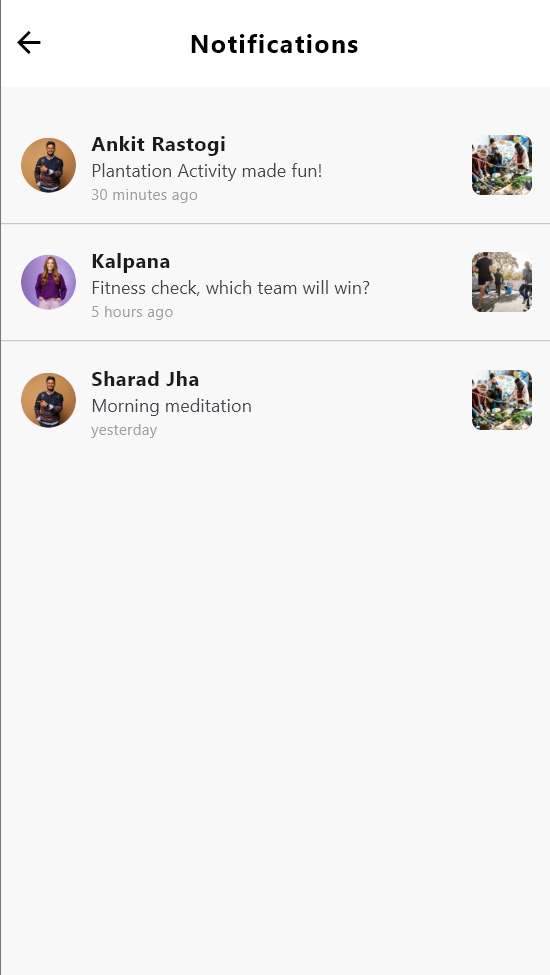

# 🌅 Rise and Shine

A beautiful, modern Flutter app for event management, team engagement, and social sharing! 🚀

---

## ✨ Features

- **Gorgeous Onboarding & Login**: Smooth, branded login and splash screens.
- **Home Feed**: See upcoming events, featured speakers, and a vibrant social feed.
- **Interactive Feed**: Like, comment, and create posts with images. Delete your own posts and comments.
- **Notifications**: Stay updated with real-time post notifications.
- **Custom Drawer**: Access Home, Feed, and Logout with a stylish side drawer.
- **Comment System**: Add, view, and delete comments with a modern chat-like UI.
- **Image Picker**: Attach images to your posts directly from your device.
- **Beautiful Gradients & UI**: Consistent, eye-catching design throughout.

---

## 📱 Screenshots

| Login | Home | Feed | Post | Comments | Notifications |
|-------|------|------|------|----------|---------------|
|  |  |  |  |  |  |

---

## 🚀 Getting Started

1. **Clone the repo:**
   ```bash
   git clone https://github.com/yourusername/riseandshine.git
   cd riseandshine
   ```
2. **Install dependencies:**
   ```bash
   flutter pub get
   ```
3. **Add your assets:**
   - Place images in `assets/images/Ios/` and `assets/images/Android/` as per the app's requirements.
   - Update `pubspec.yaml` if you add new assets.
4. **Run the app:**
   ```bash
   flutter run
   ```

---

## 🛠️ Tech Stack
- **Flutter** 3.x
- **Provider** for state management
- **image_picker** for image uploads
- **Shared Preferences** for local auth
- **Custom UI/UX** with gradients, cards, and more

---

## ⭐ If you like this project, give it a star!

---

> Made with ❤️ using Flutter.
